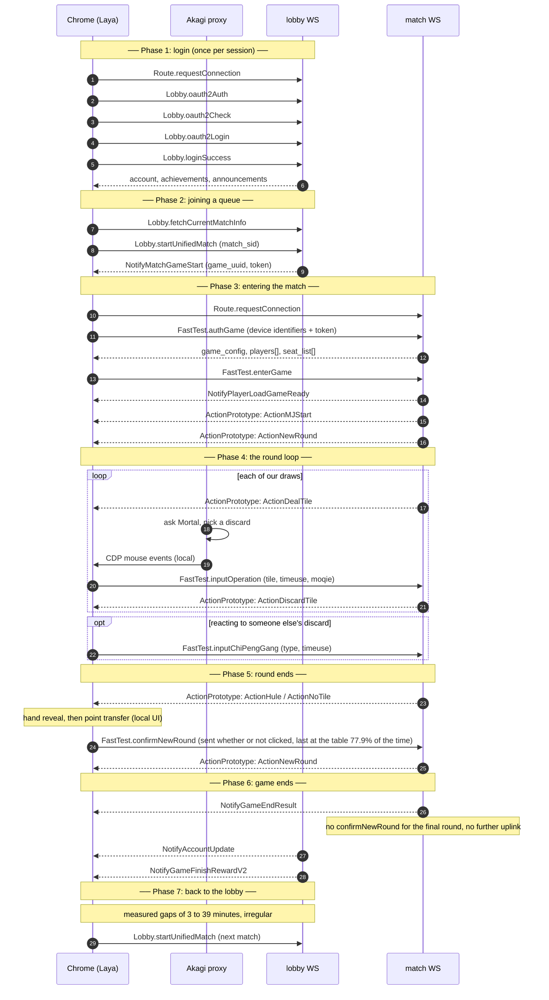

# From login to game end: what the server is told

Last updated: 2026-09-01

Where [`01-what-the-server-sees.md`](01-what-the-server-sees.md) asks whether a given action reaches the server, this document follows **a whole session in order** — what gets sent at each moment, and what the server can reconstruct afterwards. Everything below comes from intercepted traffic, not from reading Akagi's source.

## Source data

Logs recorded by Akagi's MITM proxy: 16 sessions, 7,499 uplink actions, 402 completed rounds.

```
<Akagi>/target/debug/logs/<session>/majsoul/
  000001-wss___engsbk_..._gateway.log            ← lobby
  000003-wss___engsbk_..._game-gateway-zone.log  ← first match
  000006-wss___engsbk_..._game-gateway-zone.log  ← second match
  ...
```

One frame per line: `{"dir":"up|down","method":".lq....","msg_id":N,"payload":{...},"ts":"...","type":"REQUEST|RESPONSE|NOTIFY"}`. Every figure and payload quoted below is taken from these files.

## The shape of a session: two WebSockets

This is the structural fact everything else follows from. **The lobby connection is held open for the whole session, and each match opens a connection of its own.**

```
                  ┌─────────────────────────────────────────────┐
   login ────────▶│  lobby WS   .../gateway                     │  held open all session
                  │  Lobby.*  /  Route.heartbeat  /  loginBeat  │  ← one login, total
                  └───────────────┬─────────────────────────────┘
                                  │ NotifyMatchGameStart
                                  ▼
                  ┌─────────────────────────────────────────────┐
   match 1 ──────▶│  match WS   .../game-gateway-zone           │  new connection per match
                  │  FastTest.*  /  ActionPrototype             │  ← closed at game end
                  └─────────────────────────────────────────────┘
                                  │
   match 2 ──────▶       (another new match WS)
```

One EN-server lobby connection, about two hours and forty minutes:

| | Count |
|---|---|
| `Lobby.oauth2Login` | **1** |
| `Lobby.startUnifiedMatch` | 5 |
| `NotifyMatchGameStart` | 5 |
| New match WebSockets | 5 |

**Five matches on a single login.** That ratio is what a human session looks like, and it is the sharpest difference from a fully automated one — which logs in once per match.

The same session also logged into the JP lobby twice without playing anything — just looking. Count logins per connection, or that kind of thing inflates the total.

## Sequence



## Payloads, phase by phase

### Phase 1 — login

`oauth2Login` is the cheapest event on the server to aggregate, which makes **its frequency and regularity the first thing any automation check would look at**.

### Phase 3 — the device information in `authGame`

Sent on entry to every match, carrying the browser and hardware configuration verbatim:

```json
{
  "account_id": 100000000,
  "game_uuid": "<match uuid>",
  "token": "<session token>",
  "device": {
    "device_id": "<profile uuid>",
    "hardware": "pc", "os": "mac", "platform": "pc",
    "is_browser": true, "software": "Chrome",
    "screen_width": 0, "screen_height": 0,        // your window size
    "user_agent": "Mozilla/5.0 (Macintosh; ...) Chrome/151.0.0.0 ..."
  }
}
```

`device_id` belongs to the browser profile, and local storage scopes it per origin. **As long as the same profile directory is reused, the identifier persists for a given region**, so every account played there shares it while JP and EN keep separate ones. Deleting the profile mints new ones, though an account whose device identity changes is itself an observable event.

### Phase 4 — discards

An actual payload:

```json
{"type": 1, "tile": "6z", "timeuse": 3, "moqie": false,
 "index": 0, "gap_type": 0, "auto_operation": false,
 "cancel_operation": false, "change_tiles": [], "tile_state": 0, "tile_states": []}
```

| Field | Contents | What it enables |
|-------|----------|-----------------|
| `type` | Operation kind: 1 discard, 0 pass, 7 riichi | — |
| `tile` | The discard | **Agreement with Mortal's recommendation** |
| `timeuse` | Think time, **whole seconds** | Distribution shape |
| `moqie` | Straight from the draw? | Hand-discard vs tsumogiri ratio |
| `auto_operation` | Did the client act on its own? | Detects idling and disconnection |

Calls and passes use `inputChiPengGang`:

```json
{"type": 0, "index": 0, "timeuse": 3, "cancel_operation": true}
```

Coordinates, cursor paths and mouse-button identity appear in **none** of it.

### Phase 5 — the round confirmation

Clicks on the settlement screens are handled inside the client. **Exactly one `confirmNewRound` goes out per round**, with an empty payload:

```json
{}
```

So the only information the server gains is **timing** — how long after `ActionHule` or `ActionNoTile` the confirmation arrived.

It cannot tell whether the button was pressed. **Leaving it alone still sends it**, because the client fires it on a timeout; all 402 rounds produced one, with no gaps. What it does leak is how long we take to send it, measured [below](#2-our-confirmation-is-always-last-at-the-table).

### Phase 6 — game end

After `NotifyGameEndResult`, **no uplink is sent on the match WebSocket at all**. Scanning every log turns up no `voteGameEnd` and no `terminateGame`. Settlement arrives on the lobby connection as `NotifyGameFinishRewardV2`.

Across 81 game endings, the first thing the client sends afterwards:

| First uplink | Count |
|---|---|
| `Lobby.fetchAccountInfo` | 76 |
| `Route.requestConnection` (socket reconnect) | 4 |
| `Lobby.fetchServerTime` | 1 |

All on the lobby connection, at a median of 22.3 seconds. **The final round has no `confirmNewRound`** — all 402 confirmations belong to rounds that had a successor. The post-game score and reward screens are therefore purely local, with no RPC corresponding to dismissing them.

Placement, rank movement (`level_change`, `origin` to `final`) and rewards all arrive before we transmit anything. **The result is committed and recorded at that point**, and nothing done afterwards affects it.

### Disconnecting right after a game ends

Short version: **the server can tell, but once the game is over that only means the application closed.**

The reasoning that "an empty payload failing to arrive gives away the disconnect" is sound for the `confirmNewRound` between rounds. It does not apply at game end, because nothing is due there in the first place. Sending nothing is the normal case.

The disconnect itself, though, is not something the server has to infer — **it raises an explicit event and broadcasts it to the other players.** Notifications received in the measured logs:

| Notification | Count |
|---|---|
| `NotifyPlayerConnectionState` | 221 (`READY` 107, `AUTH` 65, `NULL` 27, `SYNCING` 22) |
| `PlayerLeaving` | 2 |
| `NotifyAnotherLogin` | 2 |

Every one of those is **someone else's state arriving at our client**, and the reverse holds too: drop out and the other three are told, watching `NULL` → `AUTH` → `SYNCING` → `READY` go by. Heartbeats stop too, so it is unambiguous at the transport layer regardless.

Putting that together:

- **Disconnecting mid-game is fully recorded.** It exists as an explicit event and the table saw it. It is indistinguishable from a bad connection, but a high rate of it becomes a signal in its own right.
- **Disconnecting after `NotifyGameEndResult` is harmless.** There is no match left to abandon, and every player eventually closes the client.
- The only thing skipped is the `fetchAccountInfo` that normally follows about 22 seconds later, which is ordinary lobby chatter and weak evidence of anything.

Walking away and letting the connection lapse looks the same from the server's side. After the game has ended there is nothing to distinguish.

## What the server can reconstruct

**Public, in the replay:** every player's discards, calls and wins, with the full point history.

**Tied to the account:**

| Item | Source |
|---|---|
| Login times and frequency | `oauth2Login` |
| Device identifiers: `device_id`, user agent, resolution | `authGame` |
| **Think time per discard** | `inputOperation.timeuse` |
| **Hand discard vs tsumogiri** | `inputOperation.moqie` |
| **Seconds from round end to confirmation** | `ActionHule` → `confirmNewRound` |
| **Where that confirmation fell among the four** | Arrival order of all four `confirmNewRound` |
| Disconnects and reconnects | `NotifyPlayerConnectionState`, `PlayerLeaving` |
| Match count and session length | The sequence of `startUnifiedMatch` |
| Client-side auto-discards | `auto_operation: true` |

Whether any of this is retained and analysed is unknown. Designing as though **all of it is available** is the safe assumption.

## Two findings that changed the plan

### 1. `timeuse` is whole seconds, and it truncates

Of 7,499 uplink actions, **not one carried a fractional `timeuse`**.

```
timeuse distribution (seconds)
  0:   101 ( 1.3%)
  1:  2964 (39.5%)   ← mode
  2:  2641 (35.2%)
  3:   940 (12.5%)
  4:   408 ( 5.4%)
  5:   207 ( 2.8%)
  6+:  ~230 ( 3.1%)
  1000000: 5         ← sentinel
```

Timeouts do not all look like that sentinel. Across a wider pool of 8,053 of our own uplink actions, 13 carried a `timeuse` between 15 and 100 — values like 20, 24, 25 and 28 — which are turns the client answered for us after every press was lost, stamped with the real elapsed time and with `auto_operation` left `false`. They are indistinguishable on the wire from a very long deliberate think, which is precisely what makes them worth eliminating rather than filtering ([`04-click-reliability.md`](04-click-reliability.md)).

Comparing our own 5,516 discards against wall-clock elapsed time shows the client **truncates rather than rounds**. Elapsed times in the 0.5-1.0 s band report as `0`, not `1`; the 1.0-1.5 s band reports as `1`. Under rounding the first of those would come back as `1`.

Two consequences, pulling in opposite directions:

**Millisecond adjustments are invisible, and two of the settings cannot matter at all.** A floor at 987 ms and one at 1000 ms differ only in which second they fall into. `hover_delay_ms` and `inter_click_delay_ms` are never transmitted, and they are also part of the `click_overhead_ms` that Akagi subtracts from its sleep before clicking, so moving them shifts time between the sleep and the hover without changing when the click lands. Both are back at Akagi's defaults, as is `min_button_delay_ms` — 1523 and 1600 both report as `1`.

**Second boundaries, on the other hand, decide whether a whole bucket exists.** Akagi aims for `total_target_ms` as the server-observed total and subtracts the click overhead to hit it, which works for any target above the floor. But the floor clamps the *sleep*, and the overhead is then added back on top, so the observed minimum is `min_delay_ms` plus the overhead. The arithmetic is exact: measured while the odd values above were in place, a 987 ms floor plus 187 ms hover plus 100 ms hold plus 38 ms of latency is 1.312 s, which is precisely the first percentile of our 5,706 measured discards. At Akagi's defaults of 1000 and 200 the same sum is about 1.34 s.

The consequence is that at Akagi's default floor of 1000 ms, **every decision the model wants to make in under a second still arrives as `timeuse: 1`**. Our discards reached bucket 0 on 1.1% of occasions against 9-11% for real opponents. Lowering `min_delay_ms` to 600 puts the observed floor near 938 ms; anything above 680 is indistinguishable from the default. See [`03-fitting-a-delay-model.md`](03-fitting-a-delay-model.md).

What remains worth tuning is the **shape of the whole-second histogram** that `delay.lua` produces: whether it piles up in one bucket, or only ever emits `0` and `1`.

### 2. Our confirmation is always last at the table

Measuring from the end of a round (`ActionHule`, `ActionNoTile` or `ActionLiuJu`) to `confirmNewRound`, across 402 rounds:

```
  min      2.71s
  p10     10.24s
  median  17.81s
  p90     22.31s
  max     32.53s
  sd       4.25s

  0-  4s  ##  5
  5-  9s  #  3
 10- 14s  ##################  60
 15- 19s  ###################################################################  217  ← 54%
 20- 24s  #################################  107
 25s+     ###  10
```

**That is not one distribution.** Split by how the round ended, it decomposes into four modes, each set by the length of an animation:

| Round ending | n | Median | Mode | Minimum |
|---|---|---|---|---|
| `ActionHule`, no ura dora | 198 | 17.74 s | 17 s ×79 | 13.08 s |
| `ActionHule`, with ura dora | 139 | 20.29 s | 18 s ×32 | 14.28 s |
| `ActionNoTile`, exhaustive draw | 60 | 10.23 s | 10 s ×42 | 6.93 s |
| `ActionLiuJu`, abortive draw | 5 | 2.72 s | 2 s ×5 | 2.71 s |

Each minimum is **the earliest moment the button becomes clickable**; before that the animation is still playing. Revealing ura dora costs about 2.5 seconds more. And the modes are far too tight to be human — 42 of the 60 exhaustive draws land between 10.21 and 10.23 seconds, which is the client's timeout firing, not a person reacting.

#### The table is waiting on us

Time from our `confirmNewRound` to the next `ActionNewRound`:

```
  p5   0.12s   p25  0.16s   p50  0.29s   p75  0.43s   p95  5.77s

  under 0.5s … 77.9%   ← we were the last of the four
  2s or more  … 10.7%   ← somebody was slower than us
```

The rounds where the button *was* pressed early confirm the interpretation directly: an abortive draw confirmed at 2.72 seconds started the next round 2.00 seconds later, and an exhaustive draw confirmed at 6.93 seconds started it 1.09 seconds later. The other three were already done. The server was waiting on us alone.

An average player is last one round in four. **At 77.9%, the other three are dismissing the screen promptly while we sit through the timeout every time.** The relative position — reliably the slowest at the table — is a cheaper thing to query than any absolute duration.

Worth keeping in proportion: this identifies a player who is not touching the settlement screen, which includes any human who steps away between rounds. It is weak alone and useful only as corroboration.

#### Clicking sooner is not the fix

Pressing at the earliest possible moment — 13.1 seconds after a win, 6.9 after an exhaustive draw — every single round produces a distribution just as inhuman as the timeout, pinned to a floor instead of a ceiling. People who click quickly do not do it every time.

The fix is **spread**: vary within the window between the animation clearing and the timeout, and occasionally let it ride. Moving a fixed value in either direction only relocates the spike. This is precisely where the removed settlement-clicking feature failed ([`01-what-the-server-sees.md`](01-what-the-server-sees.md)), and it remains an open problem.

## What full automation changes

The structure above makes the difference concrete.

| | Human, measured | Fully automated |
|---|---|---|
| `oauth2Login` | **Once** per session | Once per match, or per restart |
| Gap between matches | 3, 9, 20, 39 minutes — **irregular** | Near constant |
| `startUnifiedMatch` | By hand, when the mood strikes | Immediately after the end-of-game notification |
| Session length | Varies | Unbroken for hours |

All of that is decidable by sorting login timestamps, which makes it **orders of magnitude cheaper to run than any `timeuse` analysis**. The conclusion is that phases 2 and 7 should stay manual: no auto-login, no auto-rematch, no auto-queue. See [`06-what-gets-noticed.md`](06-what-gets-noticed.md).

## Reproducing this from your own logs

```bash
cd <repo root>
LOG=target/debug/logs/<session>/majsoul

# every action we sent
jq -c 'select(.dir=="up" and (.method|test("inputOperation|inputChiPengGang")))
       | {ts, method, timeuse: .payload.timeuse, tile: .payload.tile, moqie: .payload.moqie}' \
  "$LOG"/*game-gateway*.log

# timeuse histogram
jq -r 'select(.dir=="up") | .payload.timeuse // empty' "$LOG"/*game-gateway*.log \
  | sort -n | uniq -c

# logins per lobby connection — counting across files mixes in other servers
for f in "$LOG"/*_gateway.log; do
  printf '%s logins=%s matches=%s\n' "$(basename "$f")" \
    "$(jq -r 'select(.dir=="up").method' "$f" | grep -c oauth2Login)" \
    "$(jq -r 'select(.type=="NOTIFY").method' "$f" | grep -c NotifyMatchGameStart)"
done

# round end followed by confirmNewRound
jq -r 'select(.method==".lq.ActionPrototype" and (.payload.name|test("ActionHule|ActionNoTile")))
       // select(.dir=="up" and (.method|test("confirmNewRound")))
       | "\(.ts) \(.payload.name // "CONFIRM")"' "$LOG"/*game-gateway*.log
```

## Related

| Document | Contents |
|---|---|
| [`01-what-the-server-sees.md`](01-what-the-server-sees.md) | Reach-or-not, action by action |
| [`03-fitting-a-delay-model.md`](03-fitting-a-delay-model.md) | Where the profile numbers come from |
| [`04-click-reliability.md`](04-click-reliability.md) | The `timeuse` outliers in the histogram above, which are lost turns rather than long thinks |
| [`06-what-gets-noticed.md`](06-what-gets-noticed.md) | What gets accounts banned, in order |
